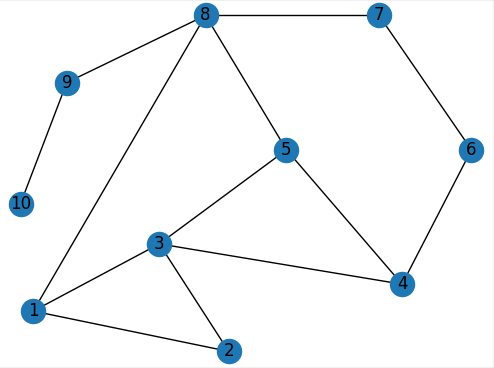
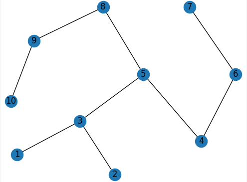
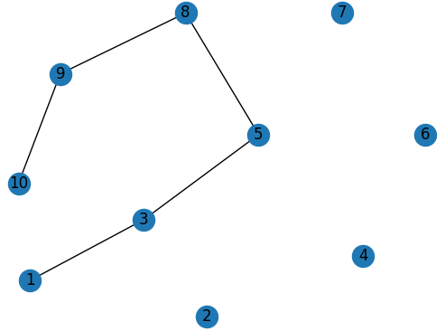
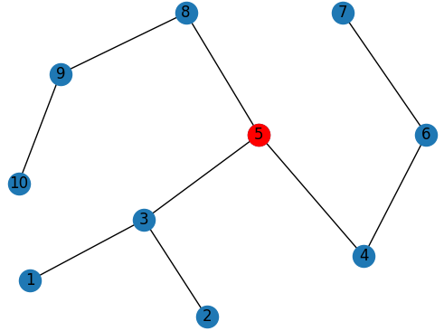

# Graph-algorithms
Dijkstra and Kruskal algorithms for finding the shortest path and MST tree in a graph.

This application has been developed to pass AISDE (algorithms and data structers) course at Warsaw Univeristy of Technology.
Besides visualization of shortest path and MST we had to find the best location for the node from whom it would be possible
to start laying fibers, which would reach all others nodes. Due to this, we accomplished the smallest cost of infrastructure.
  
To run app use a command: ```python main.py``` in terminal.

  |  
:-------------------------:|:-------------------------:
*Topology* | *MST tree*

  |  
:-------------------------:|:-------------------------:
*Shortest path 1 - 10* | *Best place for the source node*

**References:**

* [Module for printing graphs in Python](https://networkx.org/)
* [Dijkstra's algorithm](https://www.geeksforgeeks.org/dijkstras-shortest-path-algorithm-greedy-algo-7/)
* [Kruskal's algorithm](https://www.geeksforgeeks.org/kruskals-minimum-spanning-tree-algorithm-greedy-algo-2/)

**Authors:**

* Karol Harasim, Krzysztof Sadura

